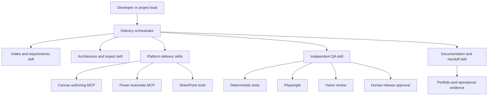
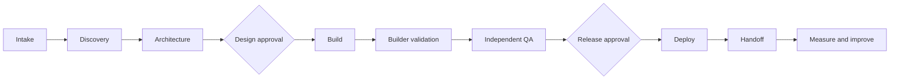
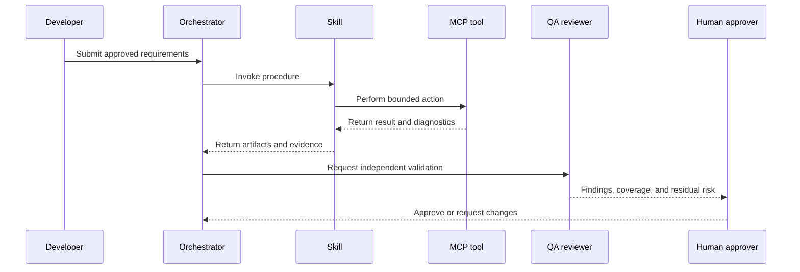
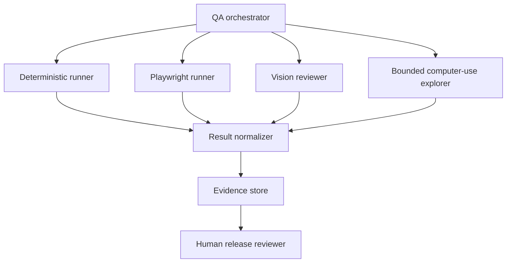
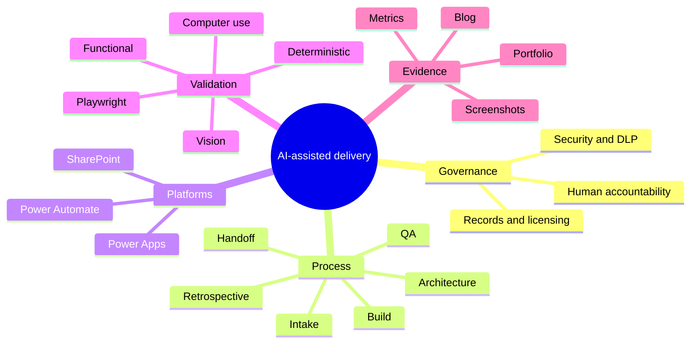

# Editable Process Diagrams

## Operating model

```mermaid
flowchart TB
    U[Developer or project lead] --> O[Delivery orchestrator]
    O --> I[Intake and requirements skill]
    O --> A[Architecture and impact skill]
    O --> B[Platform delivery skills]
    O --> Q[Independent QA skill]
    O --> H[Documentation and handoff skill]
    B --> PA[Canvas authoring MCP]
    B --> PF[Power Automate MCP]
    B --> SP[SharePoint tools]
    Q --> DT[Deterministic tests]
    Q --> PW[Playwright]
    Q --> V[Vision review]
    Q --> HR[Human release approval]
    H --> E[Portfolio and operational evidence]
```

## Lifecycle

```mermaid
flowchart LR
    A[Intake] --> B[Discovery]
    B --> C[Architecture]
    C --> G{Design approval}
    G --> D[Build]
    D --> E[Builder validation]
    E --> F[Independent QA]
    F --> H{Release approval}
    H --> I[Deploy]
    I --> J[Handoff]
    J --> K[Measure and improve]
```

## Human/agent/tool swimlane

```mermaid
sequenceDiagram
    participant D as Developer
    participant O as Orchestrator
    participant S as Skill
    participant M as MCP tool
    participant Q as QA reviewer
    participant H as Human approver
    D->>O: Submit approved requirements
    O->>S: Invoke procedure
    S->>M: Perform bounded action
    M-->>S: Return result and diagnostics
    S-->>O: Return artifacts and evidence
    O->>Q: Request independent validation
    Q-->>H: Findings, coverage, and residual risk
    H-->>O: Approve or request changes
```

## Validation architecture

```mermaid
flowchart TB
    Q[QA orchestrator] --> D[Deterministic runner]
    Q --> P[Playwright runner]
    Q --> V[Vision reviewer]
    Q --> C[Bounded computer-use explorer]
    D --> N[Result normalizer]
    P --> N
    V --> N
    C --> N
    N --> E[Evidence store]
    E --> H[Human release reviewer]
```

## Agent mind map

```mermaid
mindmap
  root((AI-assisted delivery))
    Governance
      Human accountability
      Security and DLP
      Records and licensing
    Process
      Intake
      Architecture
      Build
      QA
      Handoff
      Retrospective
    Platforms
      Power Apps
      Power Automate
      SharePoint
    Validation
      Deterministic
      Functional
      Playwright
      Vision
      Computer use
    Evidence
      Metrics
      Screenshots
      Portfolio
      Blog
```

